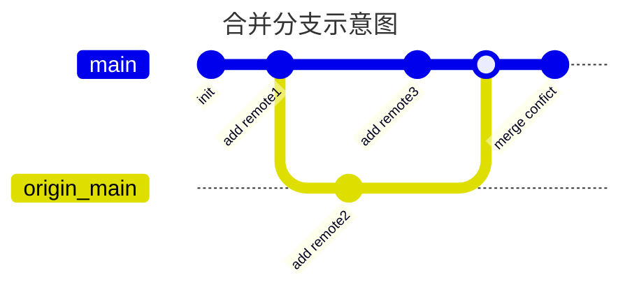

先问一下屏幕前的你，是不是还在使用压缩包传代码？是不是还在重命名一个“_备份”文件来保存修改，又或者说，对git的使用只停留在IDE的GUI上。当然作为一个合格的大一新生，这些事情估计都是常态。那么话不多说，我们直接开始——Git的正确使用姿势和最佳实践。<!-- more -->

# 什么是git

先来看看百度百科的介绍：

Git（读音为/gɪt/）是一个**开源**的**分布式版本控制系统**，可以有效、高速地处理从很小到非常大的项目版本管理。也是Linus Torvalds为了帮助管理Linux内核开发而开发的一个开放源码的版本控制软件。

Wiki讲得更清晰一点：

**Git** ([/ɡɪt/](https://en.wikipedia.org/wiki/Help:IPA/English)) is a [distributed version control](https://en.wikipedia.org/wiki/Distributed_version_control) system that tracks changes in any set of [computer files](https://en.wikipedia.org/wiki/Computer_file), usually used for coordinating work among programmers who are collaboratively developing [source code](https://en.wikipedia.org/wiki/Source_code) during [software development](https://en.wikipedia.org/wiki/Software_development). Its goals include speed, [data integrity](https://en.wikipedia.org/wiki/Data_integrity), and support for [distributed](https://en.wikipedia.org/wiki/Distributed_computing), non-linear workflows (thousands of parallel [branches](https://en.wikipedia.org/wiki/Branching_(version_control)) running on different computers).


简单点说，就是一套开源的分布式版本控制系统。有了它，把代码改崩了也不害怕。

# git下载安装

## windows操作系统

打开[git官网](https://git-scm.com/)，找到右边的Download for Windows，进去之后选择对应的版本即可。下载之后打开下载器，一定安装git bash，一直点next，最后就安装完成了，当然也可以进行个性化安装。我的建议是一开始直接next到底即可，反正你自己也不知道哪个有没有用，等自己用熟悉了git之后，重装系统或者换电脑的时候你就信手拈来了。


## Linux操作系统（以Debian为例）

更新软件库：

```bash
sudo apt update
```

下载git：

```bash
sudo apt install git
```

## 检查是否安装成功

在windows系统下，右键打开GitBash(Windows下安装的时候推荐安装GitBash)，就是一个特殊的shell，输入指令：

```bash
git --version
```


有出现版本号就代表安装成功。在Linux操作系统下同理：


# git配置

## 个人信息配置

在git安装完成之后，需要先进行一些基本的配置操作，个人信息配置主要包括用户名，账号邮箱，账号密码三部分。

配置方法如下：

```bash
git config --global user.name "Veni"

git config --global user.email "123456789@qq.com"

git config --global user.password "123456"
```

把email和密码换成自己github注册的时候使用的邮箱和密码，这样做有两个原因：

- 如果正确设置了账号密码，每次clone和pull自己的私有分支的时候就不用再输入一次，没设置好的话操作远程分支会很麻烦。
- 设置好了邮箱，github上面的contributions才能正确统计，如果没设置，哪怕你干了活人家github也不知道是你干的，就不会帮你统计提交了。

另外，设置用户名主要是为了仓库管理员可以清楚地看到每个人修改了什么，发生错误的时候可以正常回退，然后抓出来问一顿，bug说不定就解决了。

## 代理配置

有些小朋友总是说github同步代码速度慢，这里有两种方法，一种是使用魔法（施法工具得自己找），另一种是使用国内的gitee。当使用魔法的时候，就需要对git的代理进行设置。

- 首先看看自己的代理ip和端口号，一般长这样：


- 然后设置全局的http和https代理：

```bash
git config --global http.proxy http://127.0.0.1:7890

git config --global https.proxy https://127.0.0.1:7890
```

把--global去掉之后就是只设置当前仓库的代理，原理是只修改当前仓库.git/config文件里面的配置，而使用全局设置之后就是直接修改git安装目录下的.gitconfig文件。

- 当你当前仓库使用了代理之后，那么你就必须一直开着魔法工具才能正常使用，否则会报错。

## 查看配置

想要看自己设置有没有打错，可以自行查看一下，命令：

```bash
git config --global --list
```

出来的结果长这样：


如果检查完毕之后没什么问题，那就可以愉快地使用了。

## 使用SSH连接

除了配置HTTP代理之外，我们还可以采用另外一种方式连接，即SSH连接。

首先，你需要将检查自己的电脑是否有SSH密钥，打开用户的home目录，里面有一个.ssh隐藏文件夹，打开之后，如果有类似xxx.pub(一般是id_rsa.pub)这样的文件，表明自己的电脑已经有一对密钥对了，其中的pub表示的是公钥，顾名思义就是给别人用来加密的。如果没有，那就执行下面的指令，生成一对密钥：

```bash
ssh-keygen -t rsa
```

如不想定义，直接一路回车即可。之后打开.ssh文件夹，你就会看到.pub文件了。

下一步是将ssh的公钥放到github上面。

打开github->Setting->SSH and GPG keys，将刚才的pub文件里面的公钥粘贴进去就好了。之后就可以使用ssh连接了。


# git分区

先来了解一下Git的分区，不然下面的指令有可能会看不懂。首先来看一下Git的架构图：


在这个架构图中，工作区、暂存区和本地仓库（或者说提交区）是最重要的三个部分。由于Git是一个分布式的版本控制系统，它不需要一个集中的版本号，所以没有远程仓库其实也可以工作。

工作区是.git文件夹及其子文件夹的所有文件的区域，可以理解为工作区就是一个目录里面的所有文件组成的分区，没有被索引的文件都在工作区总。add指令可以将工作区中的内容添加到暂存区，暂存区里面的文件都是被tracked的文件，也就是说，任何一次commit都会对暂存区的文件做一次快照。经过commit之后，暂存区的修改就会被提交到本地仓库，本地仓库中的记录就是一个个版本，可以被回退或者创建分支。

远程仓库是一个可以实现多机共同协作的地方，每个人都可以把本地仓库里面的commit推送到远程仓库，别人也可以从远程仓库中拉取最新的代码。常见的远程仓库网站有：Github、Gitee等等，甚至也可以自己在服务器上搭建一个git仓库。

# git使用

这里用git的常用命令组织文章结构，这样写的好处是应用性较强。我推荐看看[廖雪峰的git教程](https://www.liaoxuefeng.com/wiki/896043488029600)，他使用一个仓库管理的实例和故事性的结构讲述git，我认为十分通俗易懂。

## git init

在项目的根目录下创建一个git仓库，git会对整个目录范围内的代码进行管理。比如，我在桌面创建一个example目录，然后打开目录，右键Open Git Bash here，输入指令`git init`即可初始化一个git仓库。初始化完成之后，可以打开.git隐藏文件夹，里面就有一些文件是记录当前仓库的信息的，比如config记录当前仓库设置，HEAD记录代码提交。

这个文件里面的东西不需要自己写！！！

这个文件里面的东西不需要自己写！！！

这个文件里面的东西不需要自己写！！！

重要的事情说三遍，不要自己修改把仓库玩坏了，一般来说是不用打开.git目录的，处于学习的目的可以进去研究一下。

## git add

`git add`指令的作用是将文件或者目录添加到暂存区，包括新增的，删除的，修改的。这里以刚刚创建的example文件夹为例，我创建了一个hello_world.txt文件，里面写上hello world。然后保存退出。使用git add指令将其添加到暂存区：

```bash
git add .
```

.表示当前目录，它会自动把当前目录的所有文件及其子目录里面的文件都加入暂存区，执行结果如下：


是的，你没有看错，它什么也没有发生。

## git commit

刚才使用的`git add`指令只是将其添加到git暂存区，而不是提交修改到仓库。也就是说，你自己`git add`多少次都没有影响仓库里面的东西，那么要提交的话就需要使用`git commit`指令。

`git commit`指令将暂存区提交到了仓库，仓库会为当前修改创建一个节点，每一次的commit都是仓库版本回退的节点，那些add但是没有commit的修改是不能回退的。使用方法：

```bash 
git commit -m"hello world"
```

-m后面的双引号就是本次提交的消息，一般用来记录修改了什么，执行结果如下：


接下来我们修改一下hello_world.txt里面的内容，再提交一次，修改的内容为：

```txt
hello world!
hello git!
```

然后执行

```bash
git commit -m"hello git"
```

结果如下：


那么接下来我们看一下自己的这两次修改：打开.git/log/HEAD，里面有我们的修改记录：


当然这些东西直接使用`git log`指令也可以直接看到：


commit后面的十六进制数字串就是版本号，后面是修改人的名字和邮箱，修改日期以及修改评语等。后面可以根据这个版本号直接回退到彼时的仓库状态。

## git reset

如果再某一次的修改中，代码直接崩掉无法运作了，就可以使用`git reset`指令，坐上时光机回到过去。


使用的时候它也会提醒你"Unstaged changes after reset:"，这个时候是仓库工作区（也就是代码内容）并没有回退成功的，只是撤销了最后一次提交，并且将HEAD指针移动到上一次更改，这个时候你可以加上`--hard`指令强制整个仓库（包括工作区）回退到指定的版本号。但是有一点需要注意，这个时光机是不能带着未来的东西回去的。也就是说，你后面写的代码都会被丢失，使用reset --hard指令之后，整个仓库都会回到过去的一个commit的状态。你可以打开文件看看是不是回去了。

此外，如果只是要回退一个版本号，那么不需要查版本号，只需要：

```bash
git reset --hard HEAD^
```

HEAD^代替了上一个版本号。

## git stash

暂存用于当前某一件事情做了一半的情况下，需要切换到另外一个分支处理另一个事情的时候把当前的工作区保存起来。例如，当前你正在开发一个新功能，但是突然leader说原来的版本有一个bug需要切换到另外一个分支解决，这个时候直接checkout是不会成功的，因为当前工作区发生了改变，会提示：

```shell
error: Your local changes to the following files would be overwritten by checkout:
**************
Please commit your changes or stash them before you switch branches.
Aborting
```

- 如何存储？

使用`git stash`可以简单粗暴地存储当前的工作区，但是推荐使用`git stash save "msg"`的方式，可以对存储内容进行描述，使用`git stash list`可以查看曾经存储的进度：

```shell
PS M:\MyProjects\ILOVEJava> git stash list 
stash@{0}: On newb: 添加测试
```

On ***表示再某个分支，一般情况下，从stash中恢复的时候推荐从原来stash的分支恢复，避免发生冲突。

- 如何恢复

使用`git stash pop`可以快速恢复暂存区的最新内容，`git stash pop stash@{1}`可以恢复到指定内容。

## git push

上面讲的都是在本地仓库使用Git的操作，接下来我们来用一下远程仓库，这里以Github为例。

- 首先，新建一个空仓库，建完之后长这样：


如果使用了模板创建的话，仓库在创建之初就会有一些文件，比如README.md，.gitignore等等。

- 将本地仓库与远程仓库进行关联：

每一个仓库都会有一个个人地址，将地址copy下来之后，在控制台输入

```bash
git remote add origin https://github.com/Veni222987/example.git
```

然后使用`git remote`指令可以查看所有远程仓库。

- 将本地仓库上面的东西上传到远程仓库：

使用`git push`指令可以将本地仓库上面的东西推送到远程仓库中，比如：

```bash
git push origin main
```

执行结果长这样：


之后到github上面就可以看到东西已经提交上去了。


细心的朋友可能会发现，这次提交的东西怎么是hello world呢？后来不是写了个hello git吗？这是因为，我们在上一步的时候把版本回退到了第一个版本，也就是整个仓库都是第一次提交的状态，那么push上去自然也就是那个时候的状态了。

## git pull

`git pull`指令用于把远程仓库上的代码拉取到本地仓库，执行pull指令需要注意：

- `git pull`指令相当于`git fetch`和`git merge`指令，会把远程分支和本地分支进行合并，如果远程分支包含本地分支的修改，即远程分支比本地分支先进，就会更新本地分支。

首先，在txt文件中加一行hello remote1，然后commit的消息为"add remote1"，再在txt文件中加一行hello remote2，然后commit消息"add remote2"，此时的文件应该是：

```txt
hello world
hello remote1
hello remote2
```

将add remote2的commit推送给到远程仓库：

```bash
git push origin main
```

然后版本回退到remote1：

```bash
git reset --hard HEAD^
```

此时仓库的状态是远程分支领先当前分支一个commit，使用pull可以将远程仓库的更新拉下来并且自动更新本地工作区：

```bash
git pull origin main
```

下图展示了一个单分支模型的pull过程：


- 当远程仓库和本地仓库处在两个不同的分支时，在merge的时候就可能会出现冲突：

在刚才的修改基础上，我们再退回去：

```bash
git reset --hard HEAD^
```

然后添加一行：hello remote3，即文件变成了：

```bash
hello world
hello remote1
hello remote3
```

commit当前修改:

```bash
git commit -m"add remote3"
```

这个时候，本地分支比远程分支领先1个commit，落后1个commit，而且修改的是同一个文件的同一行，会引发合并冲突：


此时需要我们手动合并冲突。出现合并冲突窗口后，不要急着关闭bash窗口，查看所有的CONFICT所在的文件，打开之后找到带有分隔符（<<<，===以及>>>）的代码段或文本段：


选择一种方案保留，（推荐使用vscode打开，可以一键选择），我这里选择了保留当前更改，然后回到git bash，此时的仓库处于MERGING状态，需要手动修改完所有冲突文件之后再commit一次才能退出该状态，然后将此修改推送到远程仓库，此时两个仓库又处于同步状态了。


本次合并的示意图如下：



如果将本地分支push到远程分支，则会将远程分支的HEAD指针指向merge conflict：


## git checkout

git checkout用于切换仓库的工作状态，比如切换到指定分支或指定提交。常见的用法如下：

```bash
git checkout <branch_name>
```

上述指令用于切换到指定分支。一般来说，在实际开发中，一个仓库会有不同的分支，不同的人管理不同的分支。使用`git chekout -b <branch_name>`可以以当前分支为基础创建并切换到新的分支；使用`git branch -a`显示所有分支。

当在不同分支工作的时候，可以相互合并分支的代码，比如本地main分支合并远程dev分支（默认为origin/dev），则可以在main分支下使用以下指令：

```bash
git pull origin dev
```

前面我们说过，`git pull`相当于`git fetch+git merge`，`git fetch`指令就是将远程分支中的内容取到本地，而git merge则用于合并。一般情况下，git会使用自带的合并策略自动完成合并，出现冲突则需要手动处理并重新提交。

如果是本地分支合并另一个分支的代码，则无需使用pull指令，而是直接使用`git merge`。比如主分支合并本地dev分支，在main分支下执行：

```bash
git merge dev
```

# 总结

git还有其他的用法，比如`git checkout`，`git merge`等等，实际上掌握了上面的常用指令之后就可以满足日常的合作开发需求了。学习git的最佳实践就是反复练习使用上面的指令，最终能够达到还没执行指令就知道会发生什么的境界，那就代表自己是真的理解了。
