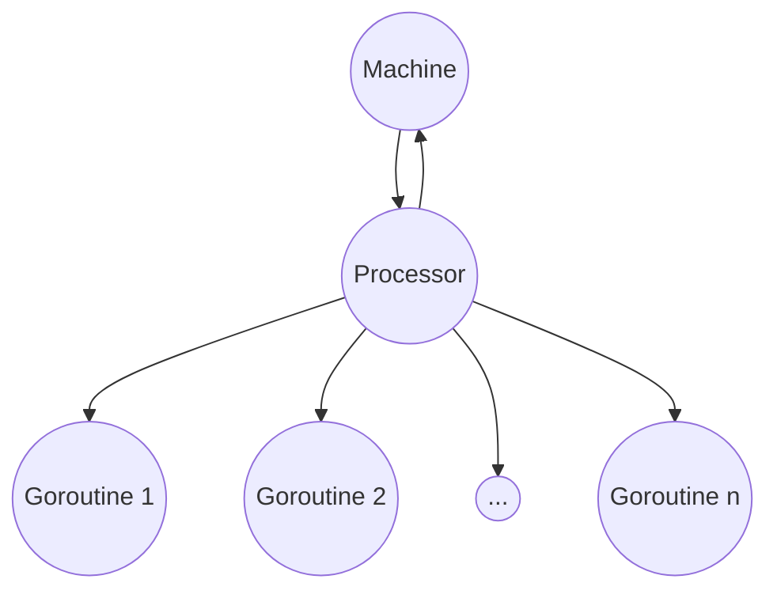
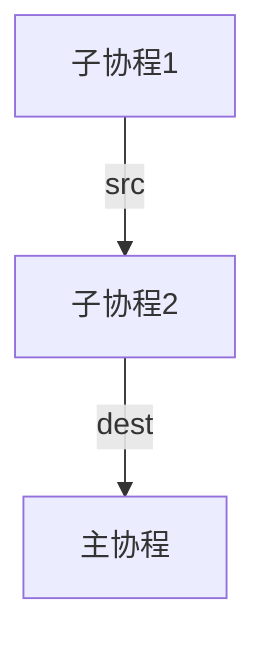

Go语言提供了强大的并发编程能力，通过Goroutines、Channels和互斥锁等机制，使得并发编程变得简单和高效。本文将使用通俗的语言和简单的案例讲述Go语言并发编程的那些事儿。<!--more-->

# 一看就明白的Go语言并发教程

## Go线程实现原理

### Go线程模型的三要素

- M(machine)：一个M代表一个内核级线程，或称“工作线程”，在Go语言中，Machine通常对应于一个操作系统线程，它可以在CPU上执行指令。
- P(processor)：一个P代表一个Go语言代码片段所需要的资源（或称上下文环境），它是Go调度器自己实现的一种调度单元。
- G(goroutine)：一个G代表一个Go语言的代码片段，G是对Go代码段的封装。

三者之间的关系如下图：



简单来说，G的执行需要P和M的支持，一个M在与P关联之后，就形成了一个有效的G运行环境（内核线程+上下文环境），每一个P都会包含一个可运行的G队列，该队列中的G会被依次传递给与其上层P关联的M中，即可以使用CPU运行G中的代码。

这个模型的核心思想是将多个goroutine调度到少量的处理器上执行，避免了每个goroutine都与操作系统线程直接关联，从而提高了并发效率。

### Go调度器

Go语言调度器是Go运行时的一部分，负责管理和调度goroutine的执行。调度器是Go语言并发模型的核心组件之一，它实现了在多个goroutine之间进行切换，从而实现并发执行的能力。调度器的主要目标是充分利用CPU资源，实现高效的并发和并行执行。

Go语言调度器具有以下特点：

- 基于G-P-M模型：即上文的Goroutine，Processor，Machine模型。
- 调度单位是处理器P：一个处理器可以在一个操作系统线程上运行，但是多个处理器可以在同一个线程上轮流执行，以实现更高的并发。处理器还负责管理goroutine的调度、垃圾回收等任务。
- 抢占式调度与协作式调度：在调度策略中，调度器的调度是抢占式的：当一个goroutine执行时间超过一定阈值时，调度器可以中断它并切换到另一个goroutine。而goroutine也可以自行退出，比如遇到网络请求或者IO操作的时候，可以自愿放弃执行，这种方式叫做协作式调度。
- 垃圾回收：调度器还负责协调垃圾回收。当垃圾回收器运行时，调度器会暂停所有goroutine的执行，确保垃圾回收可以安全地执行。垃圾回收通常会在处理器完成当前任务后执行，以减少对应用程序的干扰。

## 并发与协程(Goroutine)

### Goroutine简介

在操作系统提供的线程模型之上，Go语言通过goroutine实现了协程的概念，它是一种非常轻量级的执行单元。与传统的线程相比，goroutine的创建和销毁开销非常小，因此可以创建成千上万个goroutine，而不会消耗大量的内存和系统资源。

- 协程：用户态，轻量级线程，栈大小处于KB级别
- 线程：内核态，线程可以跑多个协程，栈大小处于MB级别

协程的调度和使用由Go语言完成，这就是Go语言的高并发的基本条件。

### GO语言实现协程

通过使用关键字`go`，可以在Go程序中启动一个goroutine，使得一个函数在一个独立的协程中并发执行。例如：

```go
func hello(i int) {
	fmt.Println("hello routine", i)
}

func main() {
	for i := 0; i < 5; i++ {
		go func(j int) {
			hello(j)
		}(i)
	}
	time.Sleep(time.Second)
}
```

`go func(j int) { ... }(i)`：在每次循环迭代时，都会启动一个新的goroutine，执行一个匿名函数。这个匿名函数接受一个整数参数`j`，该参数被初始化为当前循环变量`i`的值。`time.Sleep(time.Second)`是为了能够确保所有goroutine都结束之后再结束主函数。

上述代码也可以简写成为如下形式：

```go
func main() {
	for i := 0; i < 5; i++ {
		go hello(i)
	}
	time.Sleep(time.Second)
}
```

分别运行两次，结果如下：


这里可以看到五个协程的执行顺序是不一样的，这是由于操作系统的调度和Go语言调度的不确定性，Go的调度器会根据不同的策略将goroutines分配给不同的线程执行。这会导致不同的goroutines在不同的时间上交替执行，从而产生不确定的结果。

### 协程间通信

Go语言有一句著名的标语：通过通信实现共享内存，而不是通过共享内存实现通信。下图展现了这两种思想的不同：


在传统的操作系统做法中，把数据放在共享内存中以供多个线程访问，这种思想看似简单，实际上使得并发控制变得异常困难。Go不推荐使用共享内存传递数据，而是采用channel通信传递数据，当然还保留一些传统方法的实现（比如互斥量）。

### Channel

通道分为有缓冲通道和无缓冲通道。使用通道的一个实例，一个协程输入数字，一个协程计算平方，主协程打印结果，代码如下：

```go
func calSquare() {
	src := make(chan int)
	dest := make(chan int, 3)

	//子协程1发送数字0-9
	go func() {
		defer close(src)
		for i := 0; i < 10; i++ {
			src <- i
			//time.Sleep(time.Second)
		}
	}()

	//子协程2计算输入数字的平方
	go func() {
		defer close(dest)
		for i := range src {
			dest <- i * i
		}
	}()

	//主协程打印数字
	for i := range dest {
		println(time.Now().Format("15:04:05"), "平方数", i, "通道内元素个数", len(dest))
	}
}

func main() {
	calSquare()
}

```

- 创建channel：使用make关键字可以创建channel，比如`make(chan,int)`是一个传递整形的无缓冲channel，而`make(chan int, 3)`则是一个缓冲区大小为3的channel。
- channel输入：往channel里面输入数据需要用到左箭头`<-`，表示将右操作数送到左操作数表示的channel中。
- channel输出：需要获取channel里面的内容时，句式为`for i := range dest`，需要注意的是：当通道为空时，`for`循环会停止执行，并等待新的数据到达通道，然后继续处理数据。

我们可以看一下，上述代码在正常情况下时可以在ms级别的时间内完成运算的，如下图：


然而，当我们使得生产数据的协程每生产完一个数据后休息1秒，输出结果：


我们发现每次处理完之后，channel的大小都为0，但是都进行了下一次的平方数计算。这个例子说明了for循环把channel缓冲区里面的数据读完之后并不会立刻结束循环，而是陷入阻塞状态，等到有新的数据来到，就立刻工作。举个形象的例子，这三个协程就像是流水线上面的三个工人，子协程1效率比较低，1秒钟才生产一个配件，给到后面的协程都是立刻完成，但是后面的协程看到传送带没东西来就下班了吗？并不是，而是继续在原地等待新的零件到来，直到这条流水线关闭，即`defer close(src)`语句执行。



### 线程同步WaitGroup

在 Go 语言中，`sync.WaitGroup` 是用于等待一组 Goroutine 完成执行的同步原语。当我们开启多个协程的时候，我们并不知道哪一个协程最先完成，如果main函数结束的时候有部分协程还未结束，则会影响最终的输出结果。在上文中我们使用了`time.Sleep(time.Second)`确保所有协程都完成（因为人为可以确定1s的时间足够了），然后再退出主函数。但是当我们无法确定的时候，我们就需要使用WaitGroup再确保所有的Goroutine完成之后再执行下一步工作。下面这段代码演示了五个人开始工作，直到所有人完成工作再结束的场景：

```go
func worker(id int, wg *sync.WaitGroup) {
	wg.Add(1)
	defer wg.Done() // 减少 WaitGroup 计数器
	fmt.Printf("%d开始\n", id)
	time.Sleep(time.Second) // 模拟工作时间
	fmt.Printf("%d结束\n", id)
}

func main() {
	var wg sync.WaitGroup

	for i := 0; i < 5; i++ {
		go worker(i, &wg)
	}
	wg.Wait() // 等待所有 Goroutine 完成
	fmt.Println("所有协程结束")
}
```

运行结果：


可以看到，`wg.Wait()`一行代码等待所有 Goroutine 完成之后才算执行完毕，进入后面的打印代码。如果将这一行注释掉，那么所有Goroutine还未结束的时候就已经打印"所有协程结束"了，这很明显不符合逻辑，读者可以修改运行试试。

## Go语言同步

### 锁

Go语言中使用标准库代码包sync和sync/atomic实现同步操作。这一部分的知识需要一部分操作系统的基础知识，建议先去了解临界区、互斥量、信号量等名词。

#### 互斥锁Mutex

互斥锁是传统并发程序对于共享资源进行访问控制的主要手段，它由标准库代码包中的synnc中的Mutex类型表示。Muext类型只有三个公开的指针方法：Lock、Unlock和TryLock。其中TryLock是测试并加锁的函数，返回值为bool，当可以上锁的时候返回true。Lock方法尝试对互斥量进行加锁，如果互斥量未被锁，那么该方法会对Lock进行加锁。如果该互斥量已被上锁，那么调用该方法的goroutine会阻塞直到获取互斥量。

下面将使用一个例子具体描述互斥锁的工作过程。

```go

// AddWithMutex 使用互斥锁对num1进行加1操作
func AddWithMutex(num1 *int, mutex *sync.Mutex, wg *sync.WaitGroup) {
	defer wg.Done()
	mutex.Lock()
	defer mutex.Unlock()
	*num1++
}

// AddWithoutMutex 不使用互斥锁对num2进行加1操作
func AddWithoutMutex(num2 *int, wg *sync.WaitGroup) {
	defer wg.Done()
	*num2++
}

func AddTest() {
	num1 := 0
	num2 := 0
	var mutex sync.Mutex
	var wg sync.WaitGroup
	// 10000个协程同时对num1和num2进行加1操作
	for i := 0; i < 10000; i++ {
		wg.Add(2)
		go AddWithMutex(&num1, &mutex, &wg)
		go AddWithoutMutex(&num2, &wg)
	}
	wg.Wait()
	fmt.Println("num1 with lock:", num1)
	fmt.Println("num2 without lock:", num2)
}

func main() {
	AddTest()
}
```

这里分别启动了10000个协程，对两个整数进行+1操作。其中num1使用互斥锁相加，每次+1之前对变量进行上锁，结束后释放锁，而num2不使用互斥锁。来看一下运行结果：


num2没有加到10000，读者可以copy上述代码多运行几次，可以发现num2每次运行的结果都不一样，但是永远不会超过10000，怎么回事呢？这是因为num2的某些线程的修改丢失了，当某个goroutine拿到内存中的num2的值（假设为100）但还未+1时，突然它的运行时间到了，根据前面抢占式的原理，它被踢出运行态，改为就绪态，但是goroutine切换的时候寄存器还会保留当前goroutine的信息（即num2=100），当他再次切回运行态的时候，num2已经是101了，但是这个被切换出去的goroutine还是会执行100+1=101的操作，并将其写回内存地址中，最后导致其中一次修改丢失。

举个更容易理解的例子：在某一年的春运上，有很多人在抢最后一张机票，当用户A点击了购票但是还没付款的时候，假如购票系统没有对机票上锁，用户B也点击了购票并且比用户A更早付款完毕，写回机票数量为0。当A付款完毕之后，也写回机票数量为0，这就发生了丢失修改，两个人得到了机票，但是机票数量只减少了一张，这是明显不符合逻辑的。

正确的做法是对临界区的变量操作时，需要先对其进行上锁，操作完毕之后就释放锁。这样就可以保证每一个goroutine的修改都是有效的。

#### 读写锁RWMutex

读写锁与一般互斥锁的主要区别为：

- 当临界区未上锁时，可以添加读锁和写锁。
- 当临界区已有读锁时，可以继续添加读锁，但无法添加写锁。
- 当临界区已有写锁时，不可以再添加任何锁。

写解锁会试图唤醒所有因为要进行读或写锁定而阻塞的goroutine，而读解锁只会在没有任何锁定的情况下试图唤醒因为要进行写锁定而被阻塞的goroutine。

```go
// 模拟读操作
func read(mutex *sync.RWMutex, wg *sync.WaitGroup) {
	wg.Add(1)
	defer wg.Done()
	if mutex.TryRLock() {
		println("上读锁")
	} else {
		println("无法上读锁")
		mutex.RLock()
	}
	//模拟读2秒
	time.Sleep(2 * time.Second)
	println(time.Now().Format("15:04:05"), "读操作执行完毕")
	mutex.RUnlock()
}

// 模拟写操作
func write(mutex *sync.RWMutex, wg *sync.WaitGroup) {
	wg.Add(1)
	if mutex.TryLock() {
		println("上写锁")
	} else {
		println("无法上写锁")
		mutex.Lock()
	}
	time.Sleep(5 * time.Second)
	println(time.Now().Format("15:04:05"), "写操作执行完毕")
	mutex.Unlock()
	wg.Done()
}

// 读写锁测试
func RWLock() {
	println("开始时间", time.Now().Format("15:04:05"))
	rwMutex := sync.RWMutex{}
	wg := sync.WaitGroup{}
	//先读
	go read(&rwMutex, &wg)
	//1秒后尝试读，尝试写
	time.Sleep(time.Second)
	println("尝试读写", time.Now().Format("15:04:05"))
	go read(&rwMutex, &wg)
	go write(&rwMutex, &wg)
	wg.Wait()
}
```

运行观察结果：


开始后立刻进行读操作（记为0s），读操作需要耗时两秒，而1s时刻同时开始读和写操作，由于临界区处于读加锁的情况，可以继续加读锁，但是不可以添加写锁，所以读操作被阻塞。2s时刻和3s时刻分别完成两次读操作，然后唤醒了写操作，经过5s后（即8s时刻），写操作完成，整个进程结束。

### 条件变量Cond

#### Cond简介

在Go语言中，条件变量（`Cond`）是一种用于实现协程之间的条件同步的机制。它允许协程在满足某个条件时等待其他协程的通知。条件变量常用于实现线程池、事件循环等并发场景。条件变量是利用共享的全局变量进行同步的一种机制：

- 一个线程等待"条件变量的条件成立"挂起（或者说等待一个信号而睡眠）
- 另一个线程使"条件成立"（发送唤醒信号）

因此条件变量的使用总是和一个互斥锁结合在一起使用，这种思想就像是IPC中的睡眠与唤醒。

#### Cond使用场景

Mutex 通常用来保护临界区和共享资源，条件变量Cond 用来协调想要访问的共享资源。有一个协程正在接收数据，其他协程必须等待这个协程接收完数据，才能读取到正确的数据（比如生产者消费者问题）。

上述情形下，如果单纯的使用 channel 或者互斥锁，只能有一个协程可以等待，并读取到数据，没办法通知其他协程也读取数据。

#### Go语言sync.Cond

创建一个条件变量需要使用sync.NewCond的，sync.NewCond的唯一参数时sync.Locker类型的，可以是Mutex或者RWMutex，返回的结果是*sync.Cond类型的结构体，具有三个方法：

- Wait()：Wait方法会自动对与该条件变量相关联的那个锁进行解锁，并使它所在的goroutine阻塞。一旦收到通知，该方法所在的goroutine就会被唤醒，并且该方法会立即尝试锁定该锁。
- Signal()：通知任意一个正在等待的goroutine，唤醒一个为此而阻塞的goroutine。
- Broadcast()：通知所有正在等待的goroutine，唤醒所有为此而阻塞的goroutine。

需要注意的是Wait方法会释放锁，如果在调用该方法之前没有获得锁，就会报错`fatal error: sync: unlock of unlocked mutex`，因此Cond的使用应该是goroutine进入临界区之后，某个条件还没到位，调用Wait释放锁并睡眠，等待Signal或者Broadcast唤醒。

下面是使用Go语言sync.Cond解决生产者消费者问题的示例。

```go
func CondExample() {
	var wg sync.WaitGroup
	var mu sync.Mutex
	cond := sync.NewCond(&mu)

	wg.Add(2)
	// 生产者协程
	go func() {
		defer wg.Done()
		mu.Lock()
		defer mu.Unlock()
		println(time.Now().Format("04:05"), "开始生产")
		time.Sleep(2 * time.Second) // 模拟生产过程
		cond.Broadcast()            // 发送信号通知消费者协程
	}()

	// 消费者协程
	go func() {
		defer wg.Done()
		mu.Lock()
		defer mu.Unlock()
		cond.Wait() // 等待信号
		fmt.Println(time.Now().Format("04:05"), "消费者收到信号，开始处理")
	}()
	wg.Wait()
	fmt.Println(time.Now().Format("04:05"), "程序结束")
}
```

假设生产者协程需要2秒，消费者协程可以立刻进行，那么程序开始后，生产者开始生产，两秒后生产完成并broadcast，消费者收到信号，立即开始消费，程序结束。运行结果如下：


### 原子操作

原子操作（Atomic Operation）是计算机科学中的一个重要概念，它表示一组操作在执行过程中不会被中断，不会被其他并发操作干扰，并且在执行完毕后不可再分割为更小的操作单元。例如，Go语言提供了`sync/atomic`包，用于执行原子操作。这些操作通常包括原子加载、原子存储、原子增加、原子交换等。

#### 原子增/减

**原子增加（Atomic Increment）：** 这是一个原子操作，用于增加一个共享变量的值。无论有多少个线程或进程尝试增加这个变量的值，只有一个线程能够成功执行增加操作。**原子减少（Atomic Decrement）**也同理。

在Go语言的 `sync/atomic` 包中，`AddInt32`、`AddInt64`、`AddUint32`、`AddUint64` 等函数用于执行原子增加操作。想要执行原子减操作时，可以在函数参数中传入负数，下面是一个原子增操作的示例：

```go
func atomicAdd() {
	var i32 int32 = 0
	var ii2 int32 = 0
	var wg sync.WaitGroup

	for i := 0; i < 10000; i++ {
		wg.Add(1)
		go func() {
			defer wg.Done()
			ii2++
		}()
		wg.Add(1)
		go func() {
			defer wg.Done()
			atomic.AddInt32(&i32, 1)
		}()
	}
	wg.Wait()
	println("原子加", i32)
	println("直接++", ii2)
}
```

高并发的情况下，10000个goroutine使用原子操作依然能够保证程序的正确性，而直接相加则会在高并发的情况下出现丢失修改，无法达到10000。

#### 比较和交换CAS

比较和交换（Compare and Swap，通常缩写为CAS）是计算机科学中的一种原子操作，用于实现并发编程中的同步和互斥。它是一种基于共享内存模型的原子操作，通常用于多线程或多进程并发环境中，以确保对共享数据的安全访问。

`atomic.CompareAndSwap` 是 Go 语言中用于执行比较和交换（CAS）操作的函数，它允许在多个 goroutine 之间安全地操作共享变量。该函数有三个参数：

- **指针参数（ptr）：** 这是一个指向共享变量的指针，通常是一个内存地址。
- **旧值参数（old）：** 这是你期望共享变量的当前值等于的值。
- **新值参数（new）：** 如果共享变量的当前值等于旧值参数，那么它将被更新为新值参数。

例如，一个int32类型的CAS函数形式：`func CompareAndSwapInt32(addr *int32, old, new int32) bool`,执行该函数的时候，会先判断参数addr指向的地址值是否等于old值，如果等于old值，才会替换成为new值。如不相等，后面的替换操作就会忽略。

CAS的思想总是存在一个假设，就是该操作的值未曾改变，也就是和old值相等，一旦确认这个假设的真实性就进行替换。而使用锁则是更加谨慎，锁的思想总是假设会有并发的操作修改目标变量，并需要用锁将相关的操作保护起来。可以说，使用锁的方法比较悲观，使用CAS的方法比较乐观。所以CAS的优势是不创建互斥量的情况下完成并发操作，减少同步程序的性能消耗。劣势是目标变量被频繁修改的情况下CAS操作成功率低，甚至需要一个for循环来确保该操作完成（这就是函数返回bool类型的原因）。

下面是一个使用CAS完成并发操作的代码示例：

```go
func CAS() {
    var counter int32
    var wg sync.WaitGroup
    const numGoroutines = 100000000
    wg.Add(numGoroutines)
    for i := 0; i < numGoroutines; i++ {
        go func() {
            defer wg.Done()
            // 死循环尝试递增计数器的值
            for {
                oldValue := atomic.LoadInt32(&counter)
                newValue := oldValue + 1
                // 尝试 CAS 操作
                if atomic.CompareAndSwapInt32(&counter, oldValue, newValue) {
                    break // CAS 成功，退出循环
                }
            }
        }()
    }
    wg.Wait()
    println("结束时间", time.Now().Format("04:05"), "变量值", counter)
}
```

#### 原子载入/存储

**原子载入（Atomic Load) ** 是一种原子操作，用于从内存中读取共享变量的当前值。原子载入操作是多线程和多协程编程中的重要概念，它确保了共享数据的安全读取，是避免竞态条件和数据不一致问题的关键工具之一。Go 语言提供了 `sync/atomic` 包，其中包括 `LoadInt32`、`LoadInt64`、`LoadUint32`、`LoadUint64` 等函数，用于执行原子载入操作，读取相应类型的共享变量的当前值。

原子载入的函数形式为：`func LoadInt32(addr *int32) (val int32)`，当执行原子加载的时候，没有任何其他操作可以对此值进行读写操作，这里的约束由语言本身和底层硬件实现。

在go语言中，访问共享变量的时候应该使用原子操作。

```go
func main() {
	var sharedValue int32 = 42
	// 使用原子载入操作读取共享变量的值
	value := atomic.LoadInt32(&sharedValue)
	fmt.Println("Current value:", value)
}
```

**原子存储（Atomic Store）**与原子载入类似，在原子地存储某个值的过程中，任何操作都不会针对这个值进行读写。在go语言中修改共享变量应该使用原子存储。

## 总结

还记得本文前面说的Go名言吗？`通过通信实现共享内存，而不是通过共享内存实现通信`，事实上，我们上面使用到的线程间通信方法都遵循了这个原则。比如在互斥锁和原子操作中，我们做的事情不过是确保一个shareValue的值在高并发中不会被错误读写，而通信只是我们实现这一目标的手段，无论是锁还是条件变量，都是通信手段而不是目标。只要确保了共享内存中的值是正确的，Go语言并发的问题也就迎刃而解了。
